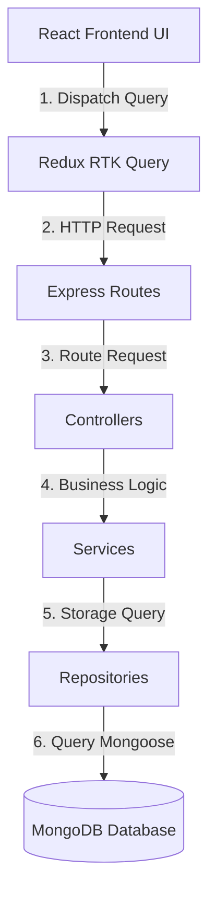

# Warehouse Inventory Management System

This is a complete and lightweight full-stack warehouse inventory management system. It provides real-time catalog tracking, secure authentication, and atomic stock adjustments to prevent concurrent data conflicts.

---

## 1. Project Overview & About

The Warehouse Inventory Management System was built to help warehouse operators, developers, and managers easily track active products, monitor safety stock alerts, and log daily inventory transaction flows. 

In busy warehouses, inventory data can quickly get out of sync due to untracked stock modifications, slow search performance in large lists, and concurrent actions where multiple users try to adjust stock levels at the exact same time. This system resolves these pain points by offering a modern decoupled architecture. It separates backend transactional controls from a highly optimized, clean frontend catalog view, providing accurate tracking and long-term codebase maintainability.

---

## 2. Core Features

The system implements the following core features:

* **User Authentication:** New users can sign up and log in securely. Authentication is handled using industry-standard tokens to protect API endpoints from unauthorized visits.
* **Role-Based Access Control:** The application supports two distinct user roles. Admins have unrestricted capabilities to add new products, edit product information, and perform stock modifications. Viewers can view the system dashboard, monitor low stock counts, and browse the inventory list.
* **Product Catalog Management:** Admins can manage product profiles by creating products with specific details such as stock keeping unit codes, names, categories, prices, and low-stock warning limits.
* **Stock IN and OUT Movements:** The system records daily warehouse transactions as either Stock IN or Stock OUT actions. Each transaction generates a historical database entry, tracking who modified the stock, how much was moved, and when it occurred.
* **Low Stock Warning Alerts:** The system flags items that fall below their defined safety threshold immediately, making it easy to identify products that require restocking.

---

## 3. The System Architecture & Flow

Data travels through a highly structured, one-way cycle to keep each layer clean, readable, and decoupled:



* **Frontend UI Components:** The React user interface captures user events, such as a product creation or a search filter, and shows clean layout boxes.
* **Redux RTK Query:** The frontend calls API endpoints using Redux slices, automatically caching data and managing client states.
* **Express Routes:** The backend receives requests on specific paths and runs security checks to verify user identity.
* **Controllers:** Controllers parse request arguments, handle parameter validations, and format outgoing HTTP responses.
* **Services:** The business logic layer applies processing rules, validates business constraints, and ensures data sanity before storage.
* **Repositories:** The repository layer isolates direct database actions away from routing and logic, making database operations simple to test.
* **MongoDB Database:** MongoDB stores document entries and executes index searches, returning results back through the system hierarchy.

---

## 4. Step-by-Step Setup and Run Guide

Follow these steps to install dependencies, configure environment files, and run the development servers.

### Backend Server Setup

1. Open a terminal and navigate to the backend directory:
   ```bash
   cd backend
   ```

2. Install all required backend dependencies:
   ```bash
   npm install
   ```

3. Configure your environment variables. Create a file named .env directly inside the backend directory and paste the following configuration:
   ```env
   PORT=5050
   MONGODB_URI=mongodb://127.0.0.1:27017/inventory_management
   JWT_SECRET=supersecretkeyhere
   JWT_EXPIRES_IN=7d
   NODE_ENV=development
   ```

4. Run the backend server in development mode:
   ```bash
   npm run dev
   ```

### Frontend Client Setup

1. Open a second terminal window and navigate to the frontend directory:
   ```bash
   cd frontend
   ```

2. Install all required frontend dependencies:
   ```bash
   npm install
   ```

3. Configure your environment variables. Create a file named .env directly inside the frontend directory and paste the following configuration:
   ```env
   VITE_API_URL=http://localhost:5050/api/v1
   ```

4. Run the frontend client in development mode:
   ```bash
   npm run dev
   ```

---

## 5. Tech Stack Used

The system is built on top of these stable technologies:

* **Node.js:** The JavaScript runtime environment used to build the scalable server application.
* **Express:** The minimalist web framework used to build routers and API routes.
* **MongoDB:** The document-based database used to store products, user accounts, and transaction records.
* **React:** The frontend library used to build the responsive user interface.
* **Tailwind CSS:** The modern styling tool used to design flat, basic, and clean corporate layouts.
* **Redux Toolkit:** The global state manager used to coordinate RTK Query caching and user credentials.

---

## 6. Technical Design Decisions & Optimizations

We made several technical design decisions to ensure the application remains highly performant, robust, and clean:

* **Race Condition Protection:** If multiple users modify the stock level of a product at the same time, traditional read-and-write logic causes stock corruption. To prevent this, our repository runs updates atomically at the database layer. We use the MongoDB $inc operator to add or subtract quantities directly in the database. Combined with a conditional $gte check on the quantity filter, the database guarantees that stock levels never drop below zero, even under heavy concurrent loads.
* **High-Speed Search Indexing:** To ensure that searching the catalog remains incredibly fast as the warehouse database expands, we configured a compound text index on the name and SKU columns of our product schema. This allows MongoDB to search records instantly, avoiding slow table scans.
* **Debounced Search Requests:** We implemented a custom useDebounce hook to optimize network traffic. When a user types a query in the search field, the frontend does not send a network request on every single keystroke. Instead, it waits until the user stops typing for 500 milliseconds. This reduces network requests, keeps the client UI responsive, and minimizes database server overhead.
* **Global Error Handling Wrapper:** To keep our controller files clean and easy to read, we avoided wrapping every method in nested try-catch blocks. Instead, we developed a catchAsync utility wrapper. If any database queries or services throw an error, the wrapper intercepts the exception and sends it directly to our centralized error middleware for standard formatting.

---

## 7. Project Assumptions & Trade-offs

During development under a strict deadline, we established the following assumptions and architectural trade-offs:

* **Reused Connection Boilerplates:** We reused clean, pre-built connection setups to connect to our database and register route paths. This allowed us to focus all development time on the core features, business rules, and UI performance.

